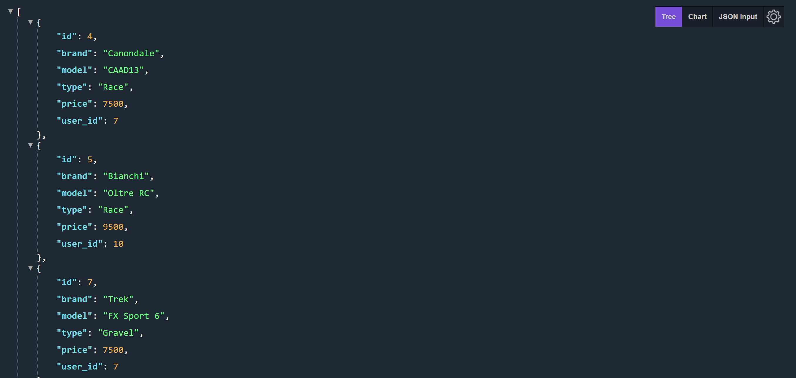
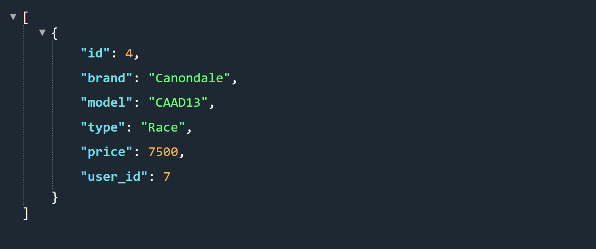
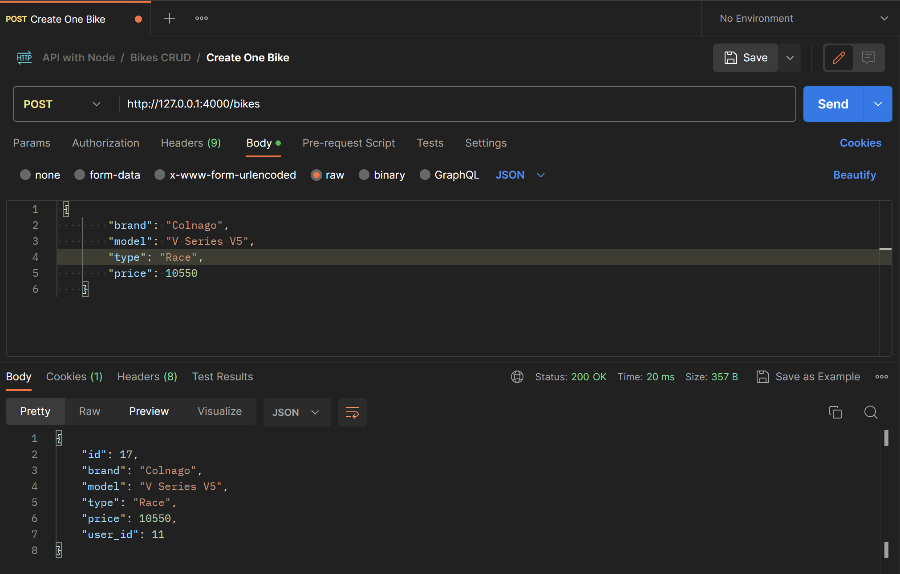

# Welcome to my the Cyclist_API

## Table of Contents
* [Introduction](#introduction)
* [Prerequisites](#prerequisites)
* [Installation](#installation)
* [Usage](#usage)
* [Authentication](#authentication)
* [Error handling](#error-handling)
* [Contact](#contact)


## Introduction
- This is a basic build for an API with Bikes to set up a website in which they can be used for cycling/sport purposes.
It was built in the context of the BeCode Junior Web Development course:

- building a simple e-shop structure with CRUD logic for the products.

- authentication and authorization for both admin and users (JWT tokens)

- comments to put on the products by users with questions or remarks

- build with Express framework in Node.JS

- this API is pure backend, this means the response in the browser or POSTMAN tool will be in JSON.

[]

The API will allow visitors to browse through bikes. The webshop would allow the users to then register, login or logout to add their own bikes, to for example the cart of the webshop.
Only the admin which is created in the database has full CRUD in all categories.
Meaning: bikes, users and comments.


[]


## Prerequisites
- An IDE like VS code to open the files and read the code.
- Terminal to run the scripts
- A databasemanagement system (e.g.: TablePlus)
- For testing: POSTMAN

## Installing

In your terminal type:

`node -v` to check if you have installed the right version of node.

If not installed, go to [NodeJS](https://nodejs.org/en/) and folloe the steps.
Make sure to choose the LTS version and follow the default options when it installs.

### Setup

In your terminal you can clone the repository using the following key: `add key`

Go to the cloned folder using the terminal:

`cd express-API-bikes`

Intall the necessary dependencies in the root of your project:
e.g.:

- cors
- nodemon
- etc.

---

### Database Manager

In your database manager you will need to set up a database with the corresponding tables (bikes, users, comments) that will used in your project.

The structure should be as follows:

**Users**
| Name | Datatype | character_Set | Allow NULL | Default |
| :---: |:---:| :---:| :---: | :---:|
| id | INT | null | no | AUTO-INCREMENT |
| user_name | VARCHAR | latin1 | no | No default |
| user_lastname | VARCHAR | latin1 | no | No default |
| email | VARCHAR | latin1 | no | No default |
| password | TEXT | | latin1 | No default |
| is_admin | TINYINT | null | no | 0 |

**Bikes**
| Name | Datatype | character_Set | Allow NULL | Default |
| :---: |:---:| :---:| :---: | :---:|
| id | INT | null | no | AUTO-INCREMENT |
| brand | VARCHAR | latin1 | no | No default |
| model | VARCHAR | latin1 | no | No default |
| type | VARCHAR | latin1 | no | No default |
| price | int | | null | No |
| user_id | int | null | no | 0 |

**Comments**
| Name | Datatype | character_Set | Allow NULL | Default |
| :---: |:---:| :---:| :---: | :---:|
| id | INT | null | no | AUTO-INCREMENT |
| subject | VARCHAR | latin1 | no | No default |
| comment_text | VARCHAR | latin1 | no | No default |
| user_id | int | null | no | No default |
| bike_id | int | null | no | 0 |

! All id should be set as `primary keys` !

---

Navigate in your prefered IDE to the root folder of the project and create a new **.env** file. Copy the contents of the **.env.example** in it. Add the following:

```
HOST=**localhost**
PORT= 4000
DB_NAME = webshop
DB_USER = root
DB_HOST = localhost
DB_PASSWORD = (your password)

JWT_ACCESS_TOKEN = (your access token)
```

---

**_Muy Importante!_**

In the project folder, make sure you add a .gitignore file, and add the following files:

- .env
- node_modules

---

From the terminal deploy from the server folder, this command:

`npm run dev`

## Usage

The terminal should now give the localhost link in which it will open in your browser.

http://localhost:4000

You can now follow the instructions from the browser.

By adding /bikes you get to see an overview of all the bikes in your database with all the linked data.
By adding another /id (id = number) you get the bike linked to this id.
If the id, or in this case bike, does not exist in the database we get an error message saying:
"bike does not exist".

By making use of **Postman** you can make use of the CRUD routes to create, update or delete bikes/products in your database.

e.g.: creating a new bike:


[]


## Authentication

Authentication works with users and admins. There is CRUD for the users table. BUT, only the admin can have access to the full READ of the CRUD.
We are using a bcrypt package in the usersController to hash the password in which later we will also use the unique value of the email to authenticate the user or admin.

## Error handling

Through middlewares we handle the following errors:

- page not found
- record not found
- input values
- authentication
- authorization

## Contact
Created by [Raoul Vandevelde](https://github.com/RalloField) - feel free to contact me!


